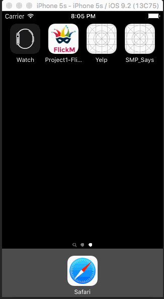

# Open source iOS App - *Stuff My Professor Says*

**Stuff My Professor Says** is a native iOS app written in swift 2.1 using the [SMPS API](http://iraleigh.github.io/Stuff-My-Professor-Says-API/).

Time spent: **10** hours spent in total

Status: In development (building towards *alpha*)

## Video Walkthrough 

Here's a walkthrough of implemented user stories:

GIF created with [LiceCap](http://www.cockos.com/licecap/).

## Notes

Source repo: https://github.com/SMPSays/iOS